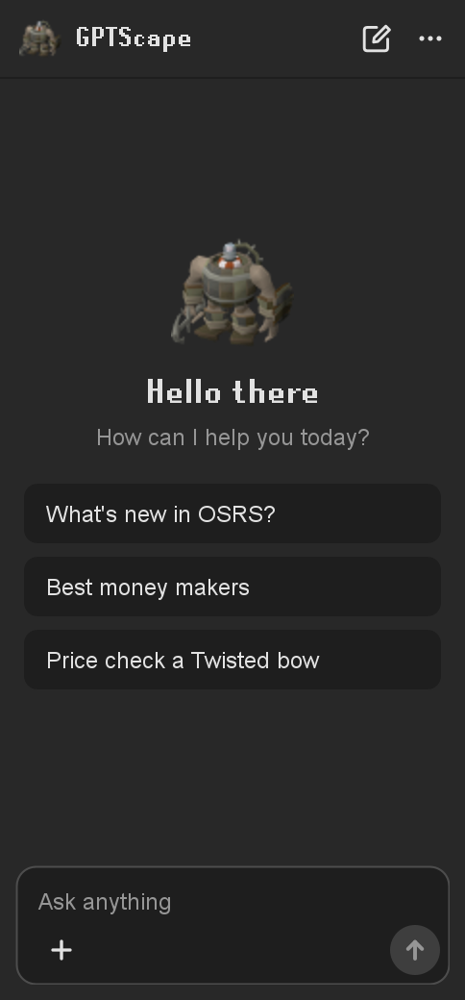
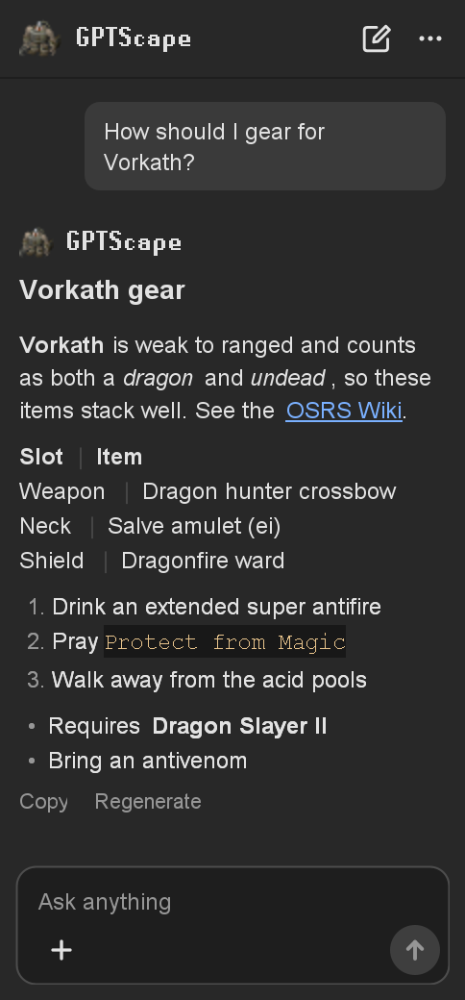
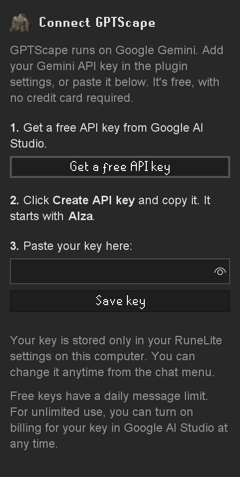
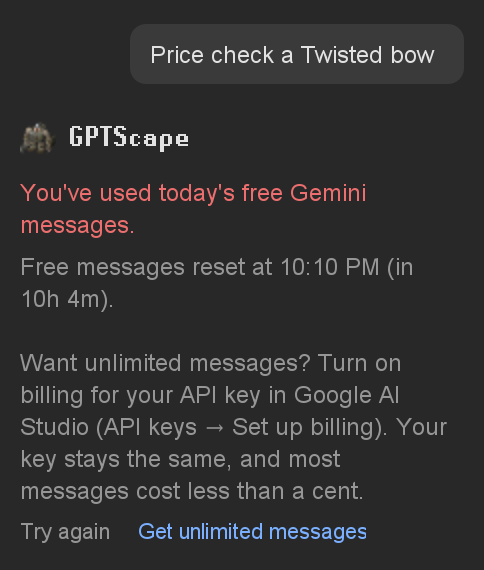

# GPTScape (RuneLite plugin)


GPTScape is an AI assistant for Old School RuneScape, built directly into the [RuneLite](https://runelite.net/) sidebar.

Ask about gear, quests, bosses, money makers or prices without leaving the game. GPTScape runs on the Google Gemini API with your own free API key, streams its answers as they are written, remembers the conversation, and can look things up on the OSRS Wiki, the official news page and the Grand Exchange.

<p align="center">
  
  &nbsp;&nbsp;
  
</p>

GPTScape only answers questions. It does not automate gameplay or perform any action in the game for you.

## Features

- **Streaming replies:** answers appear as they are written instead of all at once.
- **Conversation memory:** follow-up questions keep the context of earlier messages.
- **Multilingual conversations:** the interface is in English, but GPTScape replies in whatever language you write in and switches when you do. Official OSRS names such as Theatre of Blood or Zulrah are kept untranslated.
- **Web access:** when enabled, GPTScape can search the web, read official OSRS news, check the OSRS Wiki and look up live Grand Exchange prices. The panel shows each lookup as it happens ("Checking price: Twisted bow").
- **Markdown rendering:** headings, bold, italic, inline code, lists, tables, links and code blocks with a **Copy code** button.
- **Message actions:** **Copy** a reply, **Regenerate** the latest one, or **Try again** after a failed request.
- **Stop and start over:** stop a reply at any time, start a **New chat** or clear the current one.
- **Saved chat history:** the current chat is kept on your computer between RuneLite restarts. This can be turned off.
- **Optional game stats:** off by default. When enabled, your combat level, total level and skill levels are sent with each message so answers fit your account.
- **Model fallback:** if the selected Gemini model is unavailable or out of free quota, GPTScape automatically tries the next one.

## How to use

1. Open RuneLite and enable GPTScape.
2. Click the GPTScape icon in the sidebar.
3. Add your Gemini API key (see [Setup](#setup)).
4. Type a question in the message box.
5. Press **Enter** to send. Use **Shift+Enter** for a new line.

The **+** button under the message box toggles web access and game stats sharing. The **⋯** menu at the top lets you start a new chat, clear the chat or change your API key.

You can ask questions such as:

- "What's new in OSRS?"
- "How should I gear for Vorkath?"
- "How does Tombs of Amascut work?"
- "What's a good money maker for my stats?"
- "Price check a Twisted bow."
- "Explain Zulrah rotations."

You can also ask in your own language, for example "Como eu faço Vorkath?" or "¿Cómo se hace Vorkath?", and GPTScape will answer in that language.

## Setup

GPTScape uses your own Google Gemini API key. A key is free and does not require a credit card.

1. Go to [Google AI Studio](https://aistudio.google.com/apikey) and sign in with a Google account.
2. Click **Create API key** and copy it. It starts with `AIza`.
3. Open the GPTScape panel in RuneLite, paste the key and click **Save key**.

You can also paste the key in **Configuration → GPTScape → Gemini API Key**.

<p align="center">
  
</p>

### Installing

GPTScape is under review for the [RuneLite Plugin Hub](https://runelite.net/plugin-hub). Once it is accepted, search for "GPTScape" in the Plugin Hub inside RuneLite and click **Install**. Until then, you can run it from source as described under [Development](#development).

## Settings

| Section | Option | Default | Description |
| --- | --- | --- | --- |
| — | Gemini API Key | — | API key used to connect to the Google Gemini API. |
| Conversation | Web Access | On | Lets GPTScape look things up online: web search, OSRS news, the OSRS Wiki and live GE prices. |
| Conversation | Save Chat History | On | Keeps the current chat on your computer after restarting RuneLite. |
| Conversation | Share Game Stats | Off | Sends your combat and skill levels with each message. Your character name is never shared. |
| Advanced Settings | Gemini Model | `gemini-3.5-flash-lite` | Model used for replies. Falls back to another free model if it is unavailable. |
| Advanced Settings | System Prompt | Empty | Optional extra instructions, for example "Keep answers short." |
| Advanced Settings | Conversation History | 30 | How many recent messages are sent as context (2 to 100). Older messages stay visible in the chat. |
| Advanced Settings | Website Link | `https://gemini.google.com/` | Website opened by **Open website** in the chat menu. |

## Free tier limits

GPTScape works with the free tier of the Gemini API, and Google sets the limits:

- Each model has its own limit on free requests per minute and per day.
- The limits differ between models and Google changes them over time. The current values are listed in the [Gemini API rate limits](https://ai.google.dev/gemini-api/docs/rate-limits).
- An answer that uses web lookups takes more than one request.
- On the free tier, Google may use your conversations to improve its products. See the [Gemini API terms](https://ai.google.dev/gemini-api/terms).

When a model runs out of free requests, GPTScape automatically tries the next one, in this order: `gemini-3.5-flash-lite`, `gemini-3.5-flash`, `gemini-flash-latest`, `gemini-3.1-flash-lite`.

When every model is out of quota, the chat tells you when the free messages reset, shown in your local time.

<p align="center">
  
</p>

## Paid usage (optional)

If you want to keep chatting past the free quota, you can turn on billing for your key. This is entirely optional.

1. Open [Google AI Studio](https://aistudio.google.com/apikey) and click **Set up billing** next to your key.
2. Add a payment method. A monthly budget alert is a good idea.
3. Keep using the same key in GPTScape. No change is needed in the plugin.

Things to know:

- GPTScape itself is free and never charges you. Usage is billed by Google at its [current pricing](https://ai.google.dev/gemini-api/docs/pricing).
- Paid usage has much higher limits, but Google still applies rate limits.
- With the default model, a typical message costs a fraction of a cent.

## How it works

- **Gemini API:** GPTScape calls `models/{model}:streamGenerateContent?alt=sse` and parses the Server-Sent Events stream as it arrives.
- **API key handling:** the key is sent in the `x-goog-api-key` header. It is never placed in the URL, in the prompt or in logs.
- **Threading:** network calls run on a small background executor. UI updates are batched every 50 ms on the Swing Event Dispatch Thread, and only the reply being generated is re-rendered.
- **Context:** the most recent messages (30 by default) are sent with each request so follow-up questions make sense.
- **Web tools:** when Web Access is on, the model can call five tools: web search, official OSRS news, the OSRS Wiki, real-time GE prices from the OSRS Wiki prices API, and opening a page. Requests are only made while answering your message; nothing runs in the background.
- **Game stats:** when Share Game Stats is on and you are logged in, your combat level, total level and skill levels are read from the client and added to the request.

Built with Java 11, Swing, the RuneLite plugin API, and RuneLite's own OkHttp and Gson instances.

## Privacy and security

- Your messages are sent to Google's Gemini API using your own key.
- Your API key is stored in your RuneLite configuration and is only sent to Google.
- With Web Access on, search terms and the pages being opened are requested from third-party websites, including DuckDuckGo, the official Old School RuneScape website and the OSRS Wiki.
- Game stats are shared only if you enable **Share Game Stats**. Your character name is never sent.
- Saved chats are stored locally at `.runelite/gemini-chat/conversation.json` and contain only the role, text and timestamp of each message.
- GPTScape never needs your RuneScape login details and will never ask for them.

## Development

Requires a JDK (11 or newer). On Windows, use `gradlew.bat` instead of `./gradlew`.

```bash
./gradlew run      # start RuneLite with GPTScape loaded
./gradlew build    # compile and run the unit tests
```

Tests that call the live services are skipped unless you opt in:

```bash
GEMINI_API_KEY=your_key ./gradlew test --tests com.gptscape.GeminiClientTest   # live Gemini API tests
WEB_TOOLS_TEST=1 ./gradlew test --tests com.gptscape.WebToolsTest              # live web tool tests
GEMINI_API_KEY=your_key ./gradlew preview                                      # render panel screenshots to build/preview
```

## Contributing

Contributions are welcome: bug fixes, UI improvements, documentation and feature suggestions. Fork the repository, make your change and open a pull request. For larger changes, please open an issue first to discuss the idea.

## Support

Found a bug or have a suggestion? [Open an issue](../../issues) on GitHub and include what you asked, what happened and, if possible, a screenshot.

## Disclaimer

GPTScape is a third-party plugin. It is not affiliated with, endorsed by or associated with Jagex, Old School RuneScape, RuneLite or Google.

GPTScape is an informational assistant. It does not automate gameplay or perform actions on your behalf. Answers are generated by an AI model and can be wrong or out of date, so double-check anything important on the [OSRS Wiki](https://oldschool.runescape.wiki/). Use this plugin at your own risk.

## License

GPTScape is released under the [BSD 2-Clause License](LICENSE).
